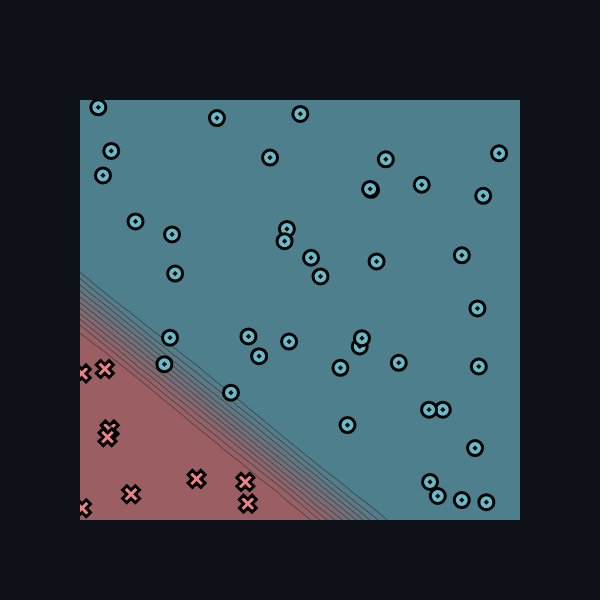

[](https://classroom.github.com/a/YFgwt0yY)
# MiniTorch Module 2


* Docs: https://minitorch.github.io/

* Overview: https://minitorch.github.io/module2/module2/

This assignment requires the following files from the previous assignments. You can get these by running

```bash
python sync_previous_module.py previous-module-dir current-module-dir
```

The files that will be synced are:

        minitorch/operators.py minitorch/module.py minitorch/autodiff.py minitorch/scalar.py minitorch/scalar_functions.py minitorch/module.py project/run_manual.py project/run_scalar.py project/datasets.py


## Simple Dataset

Parameters:
Size of hidden layer: 3
Learning Rate: 0.5
Number of Epochs: 200


```
Epoch: 0/500, loss: 0, correct: 0
Epoch: 0/500, loss: 0, correct: 0
Epoch: 0/500, loss: 0, correct: 0
Epoch: 0/100, loss: 0, correct: 0
Epoch: 10/100, loss: 32.72713115859169, correct: 32
Epoch: 20/100, loss: 29.894841077577794, correct: 32
Epoch: 30/100, loss: 23.970974355554546, correct: 32
Epoch: 40/100, loss: 16.265332056139854, correct: 48
Epoch: 50/100, loss: 11.387259976160074, correct: 50
Epoch: 60/100, loss: 7.6823727220633415, correct: 50
Epoch: 70/100, loss: 5.683451612852221, correct: 50
Epoch: 80/100, loss: 4.4850623107724275, correct: 50
Epoch: 90/100, loss: 3.65788635352188, correct: 50
Epoch: 100/100, loss: 3.0687741317870803, correct: 50
Epoch: 10/200, loss: 29.83910617704589, correct: 32
Epoch: 20/200, loss: 23.48515060304817, correct: 46
Epoch: 30/200, loss: 12.019984730929345, correct: 50
Epoch: 40/200, loss: 5.972631594029323, correct: 50
Epoch: 50/200, loss: 3.5406293759734515, correct: 50
Epoch: 60/200, loss: 2.3772694478567598, correct: 50
Epoch: 70/200, loss: 1.729518806768916, correct: 50
Epoch: 80/200, loss: 1.3282650211641585, correct: 50
Epoch: 90/200, loss: 1.0615791956211247, correct: 50
Epoch: 100/200, loss: 0.8749585338491388, correct: 50
Epoch: 110/200, loss: 0.7393387493660535, correct: 50
Epoch: 120/200, loss: 0.6379211079326389, correct: 50
Epoch: 130/200, loss: 0.5586446043559596, correct: 50
Epoch: 140/200, loss: 0.49501083709884025, correct: 50
Epoch: 150/200, loss: 0.4429666647359203, correct: 50
Epoch: 160/200, loss: 0.39974988656770927, correct: 50
Epoch: 170/200, loss: 0.3633896232125203, correct: 50
Epoch: 180/200, loss: 0.33272374499538987, correct: 50
Epoch: 190/200, loss: 0.3066917708119957, correct: 50
Epoch: 200/200, loss: 0.2841712486770088, correct: 50
```

## Diagonal Dataset:

Parameters:
Size of hidden layer: 8
Learning Rate: 0.1
Number of Epochs: 300




```
Epoch: 10/300, loss: 14.332763443165588, correct: 41
Epoch: 20/300, loss: 11.814226377573622, correct: 45
Epoch: 30/300, loss: 9.989148634866222, correct: 46
Epoch: 40/300, loss: 8.62434728547811, correct: 48
Epoch: 50/300, loss: 7.59368528079143, correct: 48
Epoch: 60/300, loss: 6.7295485248117854, correct: 48
Epoch: 70/300, loss: 6.003597802909315, correct: 49
Epoch: 80/300, loss: 5.390523443133035, correct: 49
Epoch: 90/300, loss: 4.876737890927703, correct: 50
Epoch: 100/300, loss: 4.449923530424281, correct: 50
Epoch: 110/300, loss: 4.092756244860673, correct: 50
Epoch: 120/300, loss: 3.7873862626810735, correct: 50
Epoch: 130/300, loss: 3.5224672200716056, correct: 50
Epoch: 140/300, loss: 3.2912956391056154, correct: 50
Epoch: 150/300, loss: 3.0884005010007405, correct: 50
Epoch: 160/300, loss: 2.9084425574415045, correct: 50
Epoch: 170/300, loss: 2.74781778745449, correct: 50
Epoch: 180/300, loss: 2.6039969623023547, correct: 50
Epoch: 190/300, loss: 2.4739471221941782, correct: 50
Epoch: 200/300, loss: 2.3556324814854945, correct: 50
Epoch: 210/300, loss: 2.247700129857129, correct: 50
Epoch: 220/300, loss: 2.1485466050558677, correct: 50
Epoch: 230/300, loss: 2.057499338042837, correct: 50
Epoch: 240/300, loss: 1.9735802469251607, correct: 50
Epoch: 250/300, loss: 1.895855456606272, correct: 50
Epoch: 260/300, loss: 1.823865120618899, correct: 50
Epoch: 270/300, loss: 1.7568936679261722, correct: 50
Epoch: 280/300, loss: 1.6943462291651032, correct: 50
Epoch: 290/300, loss: 1.635964934674456, correct: 50
Epoch: 300/300, loss: 1.5812659793758295, correct: 50
```

## Split Dataset:

Parameters:
Size of hidden layer: 10
Learning Rate: 0.1
Number of Epochs: 850


```
Epoch: 10/850, loss: 34.51575795136671, correct: 30
Epoch: 20/850, loss: 34.00909543726355, correct: 32
Epoch: 30/850, loss: 33.55459473145797, correct: 31
Epoch: 40/850, loss: 33.0949789736615, correct: 32
Epoch: 50/850, loss: 32.68776520907679, correct: 33
Epoch: 60/850, loss: 32.2510290547517, correct: 37
Epoch: 70/850, loss: 31.8288272813888, correct: 37
Epoch: 80/850, loss: 31.39319609300474, correct: 39
Epoch: 90/850, loss: 30.90152584106898, correct: 41
Epoch: 100/850, loss: 30.401693986781996, correct: 41
Epoch: 110/850, loss: 29.871628802605816, correct: 41
Epoch: 120/850, loss: 29.20173306945702, correct: 42
Epoch: 130/850, loss: 28.46232254052465, correct: 41
Epoch: 140/850, loss: 27.634058498021663, correct: 41
Epoch: 150/850, loss: 26.76938505564872, correct: 42
Epoch: 160/850, loss: 25.82022448674158, correct: 43
Epoch: 170/850, loss: 24.769153140985548, correct: 43
Epoch: 180/850, loss: 23.656304435839687, correct: 43
Epoch: 190/850, loss: 22.50159449871229, correct: 43
Epoch: 200/850, loss: 21.311237581186713, correct: 43
Epoch: 210/850, loss: 20.102548818425596, correct: 44
Epoch: 220/850, loss: 18.89600601658184, correct: 45
Epoch: 230/850, loss: 17.71118706572605, correct: 46
Epoch: 240/850, loss: 16.535533826173012, correct: 46
Epoch: 250/850, loss: 15.43924168800757, correct: 47
Epoch: 260/850, loss: 14.383537990674196, correct: 47
Epoch: 270/850, loss: 13.425933881051224, correct: 47
Epoch: 280/850, loss: 12.570185697097802, correct: 48
Epoch: 290/850, loss: 11.794975616373579, correct: 48
Epoch: 300/850, loss: 11.094625536852462, correct: 48
Epoch: 310/850, loss: 10.464163909522101, correct: 48
Epoch: 320/850, loss: 9.896136613535514, correct: 48
Epoch: 330/850, loss: 9.384656746331022, correct: 48
Epoch: 340/850, loss: 8.924632321166072, correct: 48
Epoch: 350/850, loss: 8.509874790945593, correct: 49
Epoch: 360/850, loss: 8.133416681990028, correct: 49
Epoch: 370/850, loss: 7.7905771484505815, correct: 50
Epoch: 380/850, loss: 7.478056649955704, correct: 50
Epoch: 390/850, loss: 7.192908807629529, correct: 50
Epoch: 400/850, loss: 6.930932084696842, correct: 50
Epoch: 410/850, loss: 6.689501521442279, correct: 50
Epoch: 420/850, loss: 6.466722319628797, correct: 50
Epoch: 430/850, loss: 6.260219485919408, correct: 50
Epoch: 440/850, loss: 6.06822767571244, correct: 50
Epoch: 450/850, loss: 5.889330996171041, correct: 50
Epoch: 460/850, loss: 5.722357059904671, correct: 50
Epoch: 470/850, loss: 5.566395381773073, correct: 50
Epoch: 480/850, loss: 5.42047883244981, correct: 50
Epoch: 490/850, loss: 5.283125381557099, correct: 50
Epoch: 500/850, loss: 5.153549779966398, correct: 50
Epoch: 510/850, loss: 5.031122439415077, correct: 50
Epoch: 520/850, loss: 4.91518123919695, correct: 50
Epoch: 530/850, loss: 4.805123414375507, correct: 50
Epoch: 540/850, loss: 4.700457362784988, correct: 50
Epoch: 550/850, loss: 4.600759533194001, correct: 50
Epoch: 560/850, loss: 4.505627302226823, correct: 50
Epoch: 570/850, loss: 4.414700804468766, correct: 50
Epoch: 580/850, loss: 4.327674739669685, correct: 50
Epoch: 590/850, loss: 4.24425097611811, correct: 50
Epoch: 600/850, loss: 4.164156866112915, correct: 50
Epoch: 610/850, loss: 4.087202331346876, correct: 50
Epoch: 620/850, loss: 4.01306940290029, correct: 50
Epoch: 630/850, loss: 3.941636036339628, correct: 50
Epoch: 640/850, loss: 3.872734091720344, correct: 50
Epoch: 650/850, loss: 3.806194178695407, correct: 50
Epoch: 660/850, loss: 3.741865126788285, correct: 50
Epoch: 670/850, loss: 3.678766181456773, correct: 50
Epoch: 680/850, loss: 3.6157832182645446, correct: 50
Epoch: 690/850, loss: 3.5545693809327266, correct: 50
Epoch: 700/850, loss: 3.4951467292648823, correct: 50
Epoch: 710/850, loss: 3.4374030850299504, correct: 50
Epoch: 720/850, loss: 3.3787225405901626, correct: 50
Epoch: 730/850, loss: 3.3181570398257176, correct: 50
Epoch: 740/850, loss: 3.2592910775049724, correct: 50
Epoch: 750/850, loss: 3.202001238548556, correct: 50
Epoch: 760/850, loss: 3.146192228039936, correct: 50
Epoch: 770/850, loss: 3.0917853703993523, correct: 50
Epoch: 780/850, loss: 3.0408119917316165, correct: 50
Epoch: 790/850, loss: 2.9971732618360143, correct: 50
Epoch: 800/850, loss: 2.954230265525758, correct: 50
Epoch: 810/850, loss: 2.9125296243592147, correct: 50
Epoch: 820/850, loss: 2.8718174832937144, correct: 50
Epoch: 830/850, loss: 2.832454941140274, correct: 50
Epoch: 840/850, loss: 2.794328323349587, correct: 50
Epoch: 850/850, loss: 2.7576118927805378, correct: 50
```

## XOR Dataset:

Parameters:
Size of hidden layer: 12
Learning Rate: 0.1
Number of Epochs: 950


```
Epoch: 10/950, loss: 33.763412359559666, correct: 33
Epoch: 20/950, loss: 33.45139283716242, correct: 33
Epoch: 30/950, loss: 33.173882307031164, correct: 35
Epoch: 40/950, loss: 32.892427569247495, correct: 36
Epoch: 50/950, loss: 32.6046064614352, correct: 36
Epoch: 60/950, loss: 32.33042249509808, correct: 37
Epoch: 70/950, loss: 32.03108792282702, correct: 40
Epoch: 80/950, loss: 31.680701860848536, correct: 40
Epoch: 90/950, loss: 31.273980492863704, correct: 40
Epoch: 100/950, loss: 30.839590985569593, correct: 40
Epoch: 110/950, loss: 30.353637661660056, correct: 38
Epoch: 120/950, loss: 29.848182220145322, correct: 37
Epoch: 130/950, loss: 29.31490059599046, correct: 37
Epoch: 140/950, loss: 28.754618804941373, correct: 37
Epoch: 150/950, loss: 28.171863823435046, correct: 37
Epoch: 160/950, loss: 27.539159168676434, correct: 37
Epoch: 170/950, loss: 26.864817216749913, correct: 40
Epoch: 180/950, loss: 26.147799402748518, correct: 42
Epoch: 190/950, loss: 25.388255932763812, correct: 42
Epoch: 200/950, loss: 24.508577293433667, correct: 42
Epoch: 210/950, loss: 23.56243237019537, correct: 43
Epoch: 220/950, loss: 22.577691491435317, correct: 46
Epoch: 230/950, loss: 21.49781988440416, correct: 47
Epoch: 240/950, loss: 20.462883136554048, correct: 48
Epoch: 250/950, loss: 19.49284299244154, correct: 48
Epoch: 260/950, loss: 18.54751446328161, correct: 49
Epoch: 270/950, loss: 17.640749806001505, correct: 48
Epoch: 280/950, loss: 16.78888604992283, correct: 48
Epoch: 290/950, loss: 15.981106370117912, correct: 48
Epoch: 300/950, loss: 15.220466278274072, correct: 48
Epoch: 310/950, loss: 14.518438939492494, correct: 48
Epoch: 320/950, loss: 13.864972384312953, correct: 48
Epoch: 330/950, loss: 13.256586453444235, correct: 48
Epoch: 340/950, loss: 12.69213896808023, correct: 48
Epoch: 350/950, loss: 12.16745454300909, correct: 48
Epoch: 360/950, loss: 11.677595899896296, correct: 48
Epoch: 370/950, loss: 11.221039918046971, correct: 48
Epoch: 380/950, loss: 10.795040130924692, correct: 48
Epoch: 390/950, loss: 10.398362916654978, correct: 48
Epoch: 400/950, loss: 10.028495720226974, correct: 48
Epoch: 410/950, loss: 9.689399139695395, correct: 48
Epoch: 420/950, loss: 9.37362704114942, correct: 48
Epoch: 430/950, loss: 9.078092410840819, correct: 48
Epoch: 440/950, loss: 8.80182317393329, correct: 48
Epoch: 450/950, loss: 8.542366180286606, correct: 48
Epoch: 460/950, loss: 8.296937777834904, correct: 48
Epoch: 470/950, loss: 8.065884318126058, correct: 48
Epoch: 480/950, loss: 7.849586355944052, correct: 48
Epoch: 490/950, loss: 7.642644006374562, correct: 48
Epoch: 500/950, loss: 7.446894699784726, correct: 48
Epoch: 510/950, loss: 7.261568618623074, correct: 48
Epoch: 520/950, loss: 7.085230516353241, correct: 48
Epoch: 530/950, loss: 6.9172703902422255, correct: 48
Epoch: 540/950, loss: 6.756523878778791, correct: 48
Epoch: 550/950, loss: 6.602961857115825, correct: 48
Epoch: 560/950, loss: 6.455739377833707, correct: 48
Epoch: 570/950, loss: 6.314474995545396, correct: 48
Epoch: 580/950, loss: 6.179311834587966, correct: 48
Epoch: 590/950, loss: 6.048897937727517, correct: 48
Epoch: 600/950, loss: 5.923054446658151, correct: 49
Epoch: 610/950, loss: 5.802572469810014, correct: 50
Epoch: 620/950, loss: 5.685596060228234, correct: 50
Epoch: 630/950, loss: 5.573084127814421, correct: 50
Epoch: 640/950, loss: 5.464626832327022, correct: 49
Epoch: 650/950, loss: 5.358524531908284, correct: 50
Epoch: 660/950, loss: 5.255693003034103, correct: 50
Epoch: 670/950, loss: 5.157050555272714, correct: 50
Epoch: 680/950, loss: 5.061753230847853, correct: 50
Epoch: 690/950, loss: 4.969459897135431, correct: 50
Epoch: 700/950, loss: 4.881448664209498, correct: 50
Epoch: 710/950, loss: 4.791774461998925, correct: 50
Epoch: 720/950, loss: 4.707677021093413, correct: 50
Epoch: 730/950, loss: 4.626914324464342, correct: 50
Epoch: 740/950, loss: 4.546009263790567, correct: 50
Epoch: 750/950, loss: 4.468555220625687, correct: 50
Epoch: 760/950, loss: 4.394618261861513, correct: 50
Epoch: 770/950, loss: 4.319105374677579, correct: 50
Epoch: 780/950, loss: 4.248129520270825, correct: 50
Epoch: 790/950, loss: 4.1778170383555855, correct: 50
Epoch: 800/950, loss: 4.110248937787615, correct: 50
Epoch: 810/950, loss: 4.0455204107554845, correct: 50
Epoch: 820/950, loss: 3.9794773878634766, correct: 50
Epoch: 830/950, loss: 3.917394424311643, correct: 50
Epoch: 840/950, loss: 3.855338759144278, correct: 50
Epoch: 850/950, loss: 3.7962985632364585, correct: 50
Epoch: 860/950, loss: 3.7371788767567624, correct: 50
Epoch: 870/950, loss: 3.681093234816357, correct: 50
Epoch: 880/950, loss: 3.624876240212697, correct: 50
Epoch: 890/950, loss: 3.571230477488205, correct: 50
Epoch: 900/950, loss: 3.5174866638900553, correct: 50
Epoch: 910/950, loss: 3.465826214738535, correct: 50
Epoch: 920/950, loss: 3.414709895759815, correct: 50
Epoch: 930/950, loss: 3.3658381289613946, correct: 50
Epoch: 940/950, loss: 3.3170434578226087, correct: 50
Epoch: 950/950, loss: 3.2704126676693765, correct: 50
```